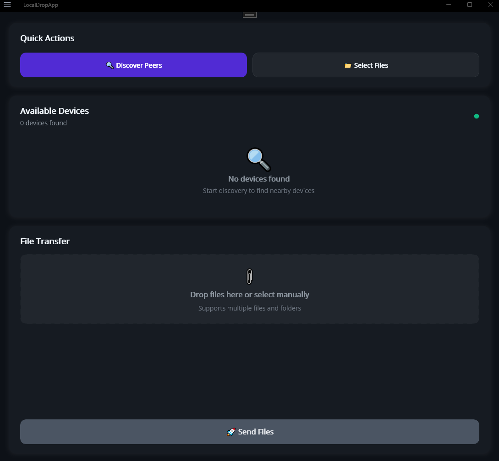
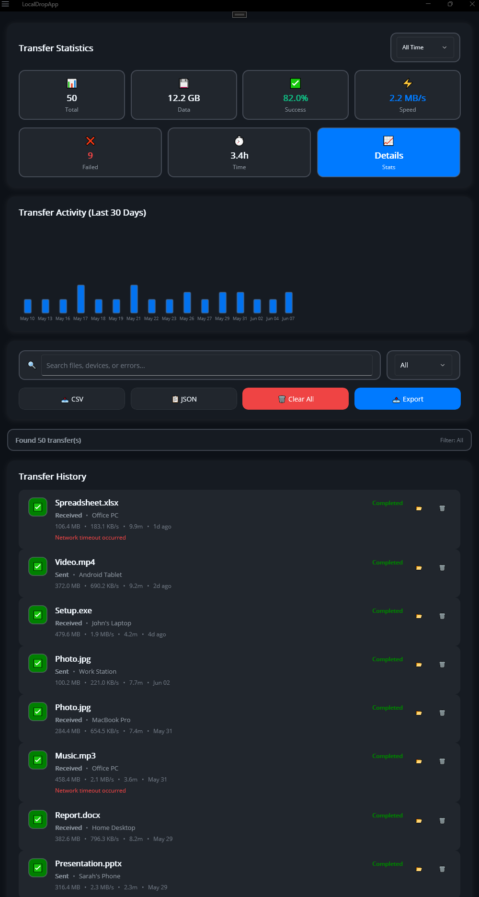
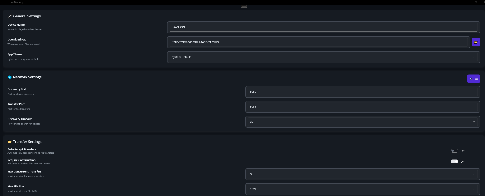
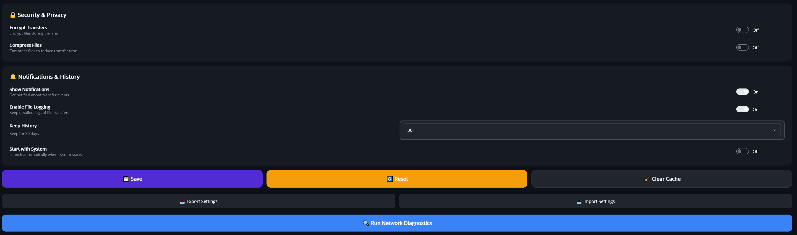

#   LocalDropApp - Cross-Platform File Transfer

> **AirDrop-style file sharing for Windows, Android, and iOS**

A modern, intuitive file transfer application built with .NET MAUI that enables seamless peer-to-peer file sharing across devices on your local network.


##  Features

- **Cross-Platform**: Windows, Android, and iOS support
- **Auto-Discovery**: Automatic peer detection on local networks
- **Multi-File Transfer**: Send multiple files simultaneously
- **Real-Time Progress**: Live transfer monitoring with speed indicators
- **Transfer Analytics**: Comprehensive history with statistics and trends
- **Modern UI**: Beautiful, responsive interface with dark/light themes

##  Screenshots

### Main Interface - Peer Discovery & File Transfer

*Clean, intuitive main interface featuring Quick Actions for peer discovery and file selection. Shows real-time device discovery status with "Available Devices" section and drag-and-drop file transfer area supporting multiple files and folders.*

### Transfer History & Analytics Dashboard

*Comprehensive transfer history interface showcasing the analytics dashboard with demo data. Features interactive charts for transfer activity visualization, detailed transfer records with file information, search and filtering capabilities, and export options for CSV/JSON formats.*

### Comprehensive Settings & Configuration

*Complete settings panel with General Settings (device name, download path, theme selection), Network Settings (discovery/transfer ports, timeout configuration), Transfer Settings (auto-accept, concurrent transfers, file size limits), Security & Privacy options (encryption, compression), and Notifications & History management.*

### Advanced Security & Privacy Controls

*Detailed security and privacy controls including transfer encryption options, file compression settings, notification preferences, file logging capabilities, history retention settings, and system startup configuration with network diagnostics tools.*


##  Getting Started

### **How to Use**
1. **Start Discovery**: Click "Start Discovery" to find nearby devices
2. **Select Files**: Use "Select Files" button or drag & drop files
3. **Choose Target**: Select a discovered peer device
4. **Send Files**: Click "Send Files" to start the transfer
5. **Monitor Progress**: Watch real-time progress in the transfer section

## 🔧 Technical Specifications

### **Network Features**
- **UDP Peer Discovery**: Automatic device detection on local networks
- **TCP File Transfer**: Reliable, chunked streaming for large files
- **SHA-256 Verification**: Ensures file integrity during transfers
- **Max File Size**: 10GB per file
- **Multiple Transfers**: Send multiple files simultaneously

### **Platform Support**
| Platform | Status | 
|----------|--------|
| ✅ **Windows 10/11** | Fully Working |
| ✅ **Android** | Fully Working |
| 🔄 **iOS** | In Progress |

##  For Developers

### **Requirements**
- Visual Studio 2022 (v17.8+)
- .NET 8.0 SDK

### **Quick Setup**
```bash

git clone https://github.com/bam2424/LocalDropApp.git
cd LocalDropApp
dotnet run --framework net8.0-windows10.0.19041.0
```

### **Project Structure**
```
LocalDropApp/
├── 📁 Models/           # Data models
├── 📁 ViewModels/       # MVVM view models
├── 📁 Views/            # XAML pages
├── 📁 Services/         # Networking services
└── 📁 Resources/        # Styles and assets
```
